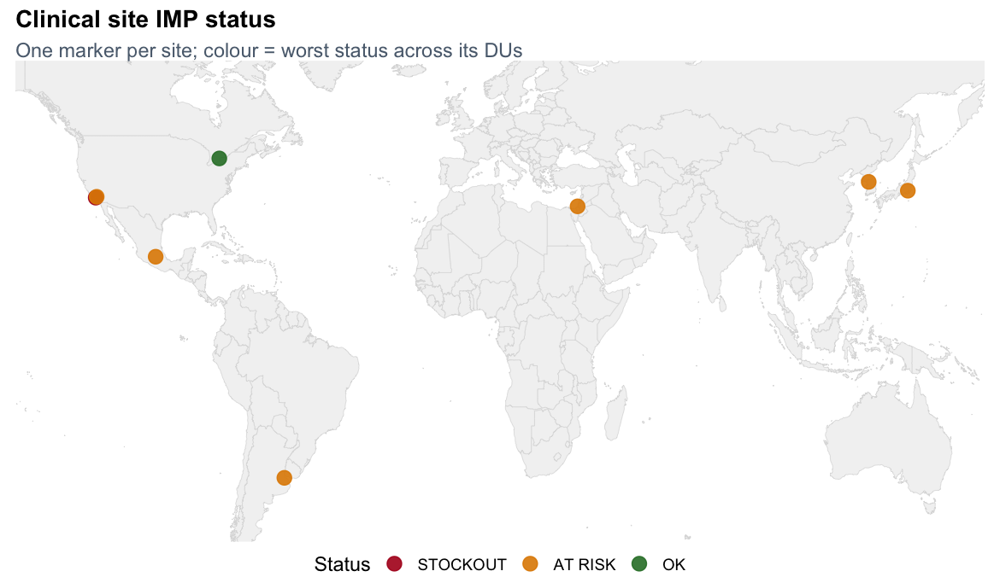
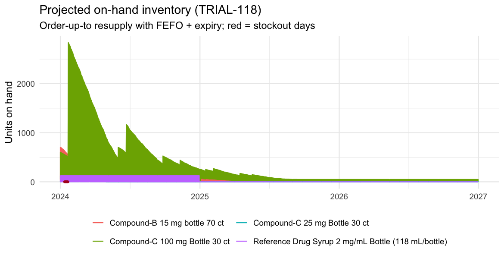
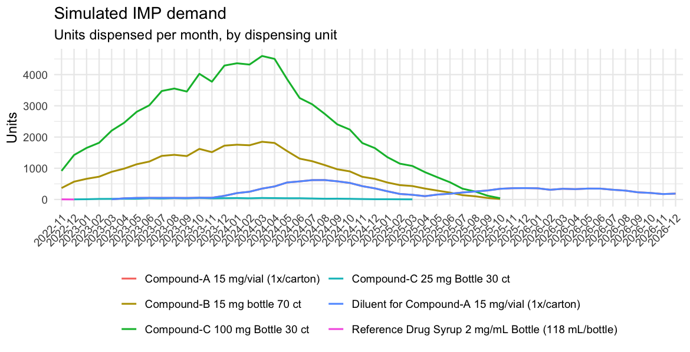
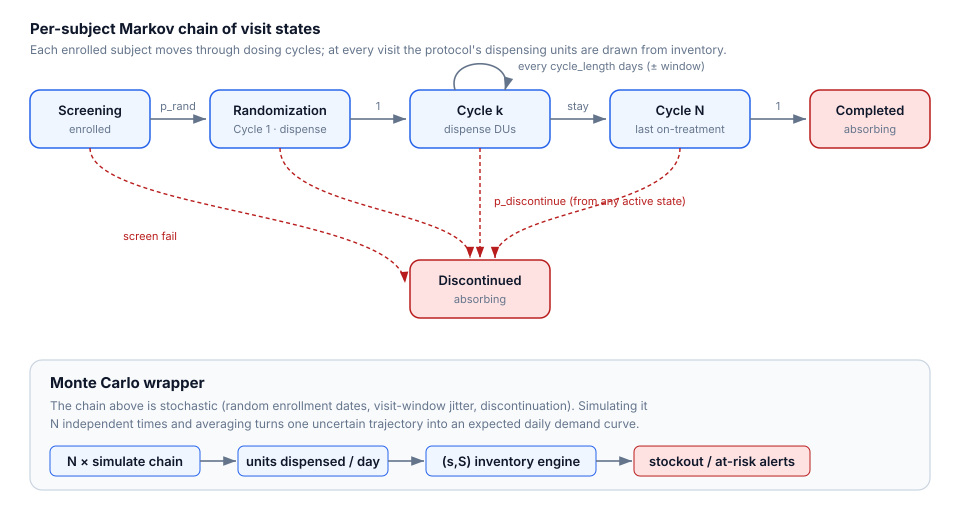

# IMP Supply Simulator

**Monte-Carlo demand forecasting and inventory-stockout prediction for clinical
trials.** Give it an enrollment plan and a dosing schedule for *any* protocol,
and it simulates patient demand, projects drug (IMP) inventory forward at every
site and depot, and tells you **where and when a site will run out** — with a
world map, a portfolio dashboard, and a live supply-chain news feed.

<!-- Replace with your deployed link once live -->
🔗 **Live showcase:** _`<netlify-url>`_ · 📄 **Write-up:** _`<medium-url>`_



---

## Why this exists

In a clinical trial, running out of investigational drug at a site is a serious
event: patients can miss doses, visits get rescheduled, and the study slips.
Supply planning is hard because demand is *stochastic* — patients enroll at
random times, progress through dosing cycles at their own pace, and sometimes
discontinue — while supply is constrained by **lot expiry**, **shipping lead
times**, and **depot capacity**.

This tool models both sides end to end so a supply manager can see problems
*before* they happen instead of reacting to them.

## What it does

| | |
|---|---|
| **Simulate demand** | Monte-Carlo enrollment → each patient walks a Markov chain of dosing cycles → units dispensed per site / DU / day, over many trials. |
| **Project supply** | An **(s, S) inventory policy** rolls stock forward day-by-day with **FEFO** consumption, **lot expiry**, depot resupply, safety stock, and lead times. |
| **Flag risk** | Every site × dispensing-unit is classified **OK / AT&nbsp;RISK / STOCKOUT** with the exact date it first runs dry. |
| **Map & drill down** | An interactive world map colours sites by status; click one for its per-DU detail and inventory-over-time chart. |
| **Portfolio view** | KPI rollup across **all** studies and sites at once. |
| **News feed** | Live supply-chain headlines (port strikes, recalls, cold-chain failures), risk-tagged, alongside your projections. |

<p align="center">
  
  
</p>

## How it works

A **Markov chain** describes one patient's trajectory (Screening →
Randomization → Cycle *k* → Completed, with Discontinued/Screen-fail as
absorbing states); dispensing happens on the transitions. A **Monte-Carlo**
loop runs that chain across all patients `N` times and averages, turning
uncertainty into an expected daily-demand curve. That curve feeds the inventory
engine.



- **Full model theory** (Monte Carlo + Markov chain, and how it differs from
  formal MCMC): [`docs/MODEL_THEORY.md`](docs/MODEL_THEORY.md)
- **Inventory-engine methodology** (the (s, S) policy, expiry, resupply, and the
  bugs found along the way): [`docs/METHODOLOGY.md`](docs/METHODOLOGY.md)

## Quickstart

**Prerequisites:** R ≥ 4.2. Install packages:

```r
install.packages(c(
  "shiny","shinyjs","shinythemes","shinycssloaders","DT","rhandsontable",
  "ggplot2","plotly","dplyr","tidyr","lubridate","stringr","readxl","readr",
  "xml2","httr"
))
```

**Run the app:**

```bash
R -e 'shiny::runApp(".", launch.browser = TRUE)'
```

It loads two sample studies (TRIAL-201, TRIAL-118) so you can click through
immediately: **Study Configuration → Visits & Demand → Supply & Inventory →
Portfolio → Site Map.**

**Run headless (batch / all protocols):**

```bash
Rscript scripts/run_simulation.R 5 2026-12-31 2024-01-01
#                                 │  │          └ inventory "as-of" date
#                                 │  └ horizon
#                                 └ number of Monte-Carlo trials
```

## Bring your own protocol

The engine is **protocol-agnostic** — it keys off column *names*, not study
codes. Supply an enrollment plan (`Protocol, Cohort, Arm, Patients,
Enroll_Start, Enroll_End, Country, Center`) and a dosing schedule (`Protocol,
Arm, DU_Description, Cycles, Cycle_Length, Option1…`); inventory columns are
mapped flexibly. `Program_Inputs.xlsx` is the input template.

## Repository layout

```
├── global.R · ui.R · server.R      # Shiny app (5 tabs)
├── R/
│   ├── simulation.R                 # DEMAND: enrollment → visits → dispensing (Markov + Monte Carlo)
│   ├── inventory.R                  # SUPPLY: (s,S) projection, FEFO, expiry, resupply
│   └── newsfeed.R                   # supply-chain news (Google News RSS + risk tagging)
├── scripts/
│   ├── run_simulation.R             # headless end-to-end runner
│   ├── generate_sample_datasets.py  # (re)generates datasets/ deterministically
│   └── make_demo_assets.R           # regenerates the README images
├── datasets/                        # SYNTHETIC sample data (safe, no real patient data)
├── docs/                            # MODEL_THEORY.md · METHODOLOGY.md · assets/
├── site/                            # static showcase site (Netlify)
└── Program_Inputs.xlsx              # input template
```

## Data & privacy

All committed data in `datasets/` is **synthetic**, generated deterministically
by `scripts/generate_sample_datasets.py`. No real patient-level or
proprietary trial data is included in this repository.

## Tech

R · Shiny · plotly · ggplot2 · dplyr · DT · rhandsontable · a hand-rolled
(s, S) inventory engine · Google News RSS. Python (openpyxl) for sample-data
generation.

---

_Built as a portfolio project by [Rafael Carlos Abbariao](https://github.com/rafaelcarlosabbariao)._
